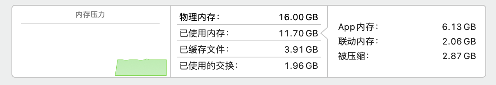

#! https://www.zhihu.com/answer/1758318424

先说结论：

是否值得购买：是否值得购买还要看具体需求，一般处理日常文档网页的话还是很值得的。

是否要上 16G 内存：同样要看具体需求，一般日常使用的话没有必要，8G 足以。（当然，最近爆出 8G 款硬盘疯狂写入的问题，为了长时间使用还是入 16G 的吧）

我并没有购买 M1 芯片的 Mac mini，但我在去年 11 月份购入了同样搭载 M1 处理器的 MacBook Air 16 + 256，二者搭载的处理器差不多(我买的是 7 核 GPU 版本)，Mac mini 的散热更好，理论上应该比我的 MacBook Air 性能更强一点。

在使用体验方面，日常处理文档、看看网页、做做ppt、记记笔记，都是可以的。我偶尔会使用这台 Mac 敲 Python 的代码，唯一的不足是目前很多第三方库没有适配，因此大多数情况下无法运行，我一般远程连接 win 来进行调试。日常开10个左右的网页，加上微信，网易云音乐什么的，后台也经常运行一些小工具，内存使用大概 11G 左右，丝毫没有卡顿的情况。

以下是我关于 M1 Mac 其他文章：

[苹果电脑那么贵，为什么还是很多人买](https://www.zhihu.com/answer/1745854151)

[新的Macbook Pro M1有必要选配16G内存吗？](https://www.zhihu.com/question/430326495/answer/1737196741)

[那些上大学使用macbook的人是什么想法？](https://www.zhihu.com/question/437114559/answer/1723879135)

[M1 版 MacBook 系列的实际上手体验如何? ](https://www.zhihu.com/question/430599830/answer/1699039794)
