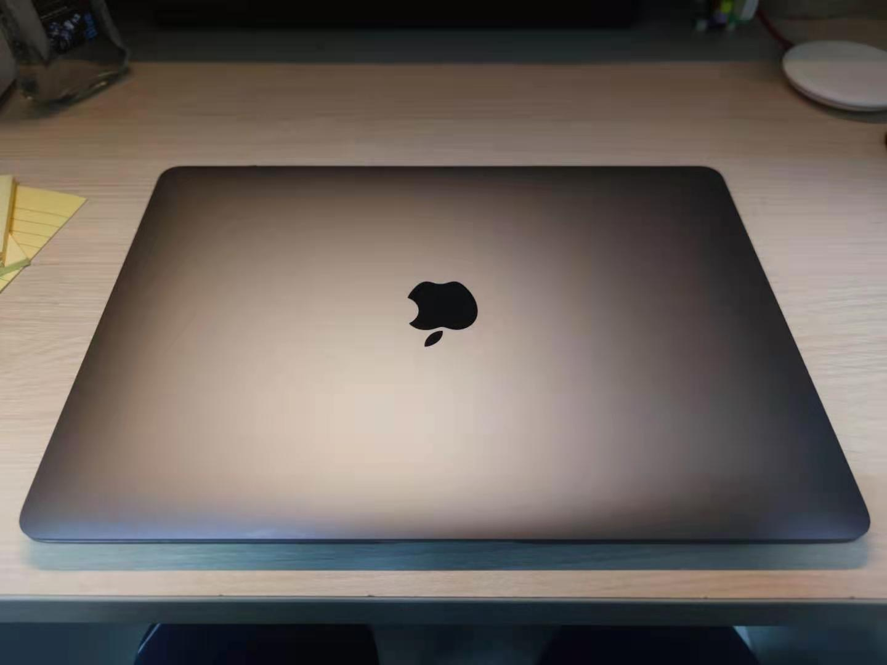

#! https://www.zhihu.com/answer/1745854151

这个问题其实和问题“[为什么那么多人喜欢苹果电脑](https://www.zhihu.com/answer/1743512687)”大同小异，可以直接点击连接看查原回答，以下为回答正文： 

正因为有很多人喜欢苹果电脑，所以即使它“很贵”，也有人愿意掏腰包购买。但是苹果电脑并不算贵，在win阵营中找到一个和 Mac 相同水平（这里相同水平不仅仅指是性能，还包括屏幕素质、质感、续航等各个方面）的机器，价格不输 Mac ，甚至会比 Mac 还要高。
我是一名数码爱好者+半个程序员，因此我认为自己对电子产品还是比较了解的，我来说一下我使用 Mac（其实是苹果全家桶）的原因吧。

我目前使用的设备有：MacBook Air M1 + iPad Air 3 + iPhone 8，除了电脑之外都是比较老的设备了，但是现在依然流畅运行，因为平时不用iPhone打游戏，只是聊聊天、看网页使用，因此没有买新款。

## 外观

MacBook产品线的外观已经很长时间没有更新老，iMac的外观更是自2010年以来就没有太大的变化。不从现在来看，除了屏幕边框有些宽之外，其他外观依旧是十分亮眼的。外观其实是许多人选择苹果电脑的重要原因，Windows阵营中比它性能强的外观没有它耐看，外观相似的与其售价不相上下（比如华为的MateBook X Pro，dell 的 XPS 系列）

## 便携

我购入它的主要原因是因为它的便携性，购入之前我使用的是接近2.5kg重的游戏本，续航也十分令人堪忧，一般撑不过三节课就没电了，所以带出去的时候都要拿上电源适配器，每天带着它就像带着几块砖头。前几年还好，大多数时候电脑不需要带出去，放在宿舍里就可以，所以当时对重量和续航也没什么感知。但是进入大三之后，出现了一些需要编程的课程，老师也要求带着电脑上课，同时去图书馆也经常需要背着电脑，因此越来越觉得游戏本是个累赘，整天带着这玩意能把我累够呛。正好这个时候苹果推出M1芯片的MacBook Air，于是就下单了。

买回来之后它确实没有辜负我的期望，长续航可以满足我一天的使用需求，通常早上出门80%左右的电，白天携带的时候不带充电器，13寸的机身和小巧的重量让我带出去没有什么负担，通常情况下经过我一天的使用（主要是上课记笔记和看文档），晚上回到宿舍还可以剩下20左右的电。

## 生态

如果你是苹果全家桶用户，那么喜欢苹果电脑的理由就又多了一个————生态，谈到苹果产品，生态是永远绕不开的话题。我对苹果生态的感知主要体现在以下几个方面：在使用电脑的时候可以直接使用电脑拨打电话、发送短信等，接收验证码也不需要打开手机了；接力功能，在手机上浏览的网页、编辑的文本可以在电脑上接着编辑，无缝衔接；共享剪贴板，手机上复制的东西，可以直接在电脑上粘贴，反之亦然。

## 体验

有关MacBook Air M1 的更多体验可以看查我之前的文章：

[新的Macbook Pro M1有必要选配16G内存吗？](https://www.zhihu.com/question/430326495/answer/1737196741)

[那些上大学使用macbook的人是什么想法？](https://www.zhihu.com/question/437114559/answer/1723879135)

[M1 版 MacBook 系列的实际上手体验如何? ](https://www.zhihu.com/question/430599830/answer/1699039794)